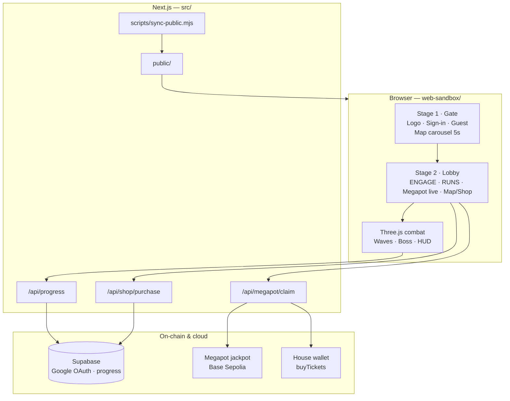
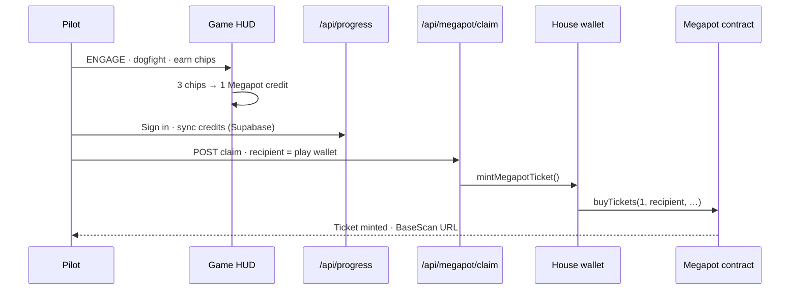
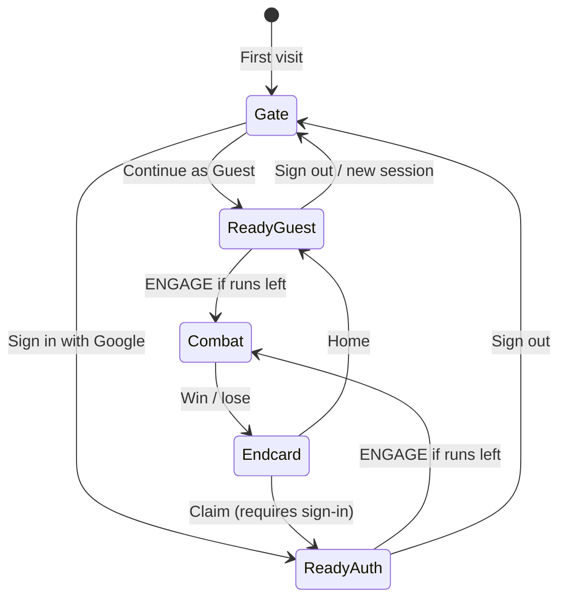

<p align="center">
  
</p>

<h1 align="center">VEIL WAR</h1>

<p align="center">
  <strong>WWII dogfight that earns Megapot credits in combat and mints a real Base Sepolia ticket on claim</strong><br />
  <a href="https://veil.sithunyein.com/">veil.sithunyein.com</a> · Inco × Megapot Summer Game Jam 2026 · Megapot track
</p>

<p align="center">
  
  
  
  
  
</p>

---

Fly a **3D WWII dogfight** in the browser. Earn **Base Chips** in combat (3 chips → 1 Megapot credit), sync with Google, then **CLAIM** a real Megapot ticket on-chain. House wallet calls `buyTickets` on Base Sepolia and returns a BaseScan proof.

**One-line pitch:** WWII dogfight that earns Megapot credits in combat and mints a real Base Sepolia ticket on claim.

---

## Judge path (60 seconds)

| Step | Action |
|------|--------|
| 1 | Open **[veil.sithunyein.com](https://veil.sithunyein.com/)** |
| 2 | **Continue as Guest** or **Sign in with Google** |
| 3 | Check lobby: **live Megapot panel**, **RUNS: x/10**, Powered by Inco + Megapot |
| 4 | Tap **<< ENGAGE >>** — WASD fly · SPACE fire · destroy scouts ahead |
| 5 | Earn **Base Chips** → **Megapot credits** (win or lose endcard both work) |
| 6 | **Sign in** (if guest) → **CLAIM MEGAPOT TICKET** → open **BaseScan** |

---

## Architecture



### Megapot core loop



### Lobby flow (two stages)



---

## Project structure

```
veil-war/
├── web-sandbox/              # ★ Source of truth — live game (Three.js SPA)
│   ├── index.html            # Combat, HUD, lobby, theaters, daily runs, SFX
│   ├── js/play-auth.js       # Google OAuth, guest wallet, Megapot claim client
│   └── assets/
│       ├── veil-war-bird-logo.png
│       ├── inco-logo.png · megapot-logo.png
│       └── sfx/
│
├── src/                      # Next.js API + deploy wrapper
│   ├── app/
│   │   ├── page.tsx          # Redirect → /index.html
│   │   └── api/
│   │       ├── megapot/claim/  # GET pool · POST mint ticket
│   │       ├── progress/       # Cloud save · Google profile
│   │       └── shop/purchase/  # Base Sepolia ETH unlock verify
│   └── lib/
│       ├── megapot/            # viem · buyTickets · pool read
│       └── shop/catalog.ts     # Armory + theater SKUs
│
├── scripts/
│   └── sync-public.mjs         # web-sandbox → public/ (every build)
│
├── supabase/                   # SQL schema · RLS
├── Assets/                     # Unity fog prototype (legacy, not judged)
├── vercel.json
├── PHASE12_SETUP.md
└── DEMO.md                     # 90s demo script
```

> **Judges:** evaluate the **web sandbox** at [veil.sithunyein.com](https://veil.sithunyein.com/). Unity under `Assets/` is legacy research only.

---

## Live features (matches production)

- **Two-stage lobby** — gate (sign-in / guest, theater background rotates every 5s) → ready lobby (ENGAGE + tabs)
- **Live Megapot panel** — drawing id + ticket price from Base Sepolia contract (`GET /api/megapot/claim`)
- **Daily runs** — **10 free sorties / day** (local midnight reset); HUD `RUNS: x/10`
- **Armory Restock +3 Runs** — **400 Combat XP** (consumable; guests can buy too)
- **Guest instant play** — no OAuth to fly; sign in to sync + claim
- **Default map** — Pristine Sunny Sky (`sunset`); theaters selectable after unlock
- **Combat** — 4 frontal scouts (wave 1), 5 (wave 2), Flagship boss; win or lose both show CLAIM
- **Chips → credits** — 3 Base Chips → 1 Megapot credit mid-mission
- **On-chain claim** — endcard → house `buyTickets` → BaseScan proof
- **Combat XP shop** — hull / muzzle / radiator + optional MetaMask ETH unlocks on Sepolia
- **Theaters** — free: Arctic, Sunny, Forest · XP/ETH: Jungle, Mountains, Village, City
- **Daily bonus** — first mission of the day +1 Base Chip
- **Minified Three.js** — `three.module.min.js` via CDN import map

---

## Megapot integration summary

| Requirement | Implementation |
|-------------|----------------|
| Earn through gameplay | Kills / chips → Megapot credits → CLAIM mints 1 ticket |
| Functional Megapot on Base | `JackpotRandomTicketBuyer.buyTickets` via house wallet (Sepolia) |
| Core loop, not link-out | Credits earned in-mission; claim on win/lose endcard |
| Live contract reads | Drawing id, ticket price, pool via `getDrawingState` |
| Working public prototype | [veil.sithunyein.com](https://veil.sithunyein.com/) |
| Public repo | This repository |

**Inco:** jam co-host + confidentiality / fog-of-war theme in the combat UI. **Megapot:** real reward and settlement layer judges can verify on BaseScan.

---

## How to run locally

### Prerequisites

- Node.js 20+
- npm
- (Optional) MetaMask on **Base Sepolia** for shop ETH unlocks
- (Optional) Supabase + funded house wallet for live claims

### Quick start

```bash
git clone https://github.com/thesithunyein/veil-war.git
cd veil-war
npm install
npm run dev
```

Open **http://localhost:3000** — syncs `web-sandbox/` → `public/` then starts Next.js.

### Production build

```bash
npm run build
npm start
```

### Environment variables

Copy `.env.example` → `.env.local`. Full setup: **`PHASE12_SETUP.md`**.

| Variable | Purpose |
|----------|---------|
| `HOUSE_PRIVATE_KEY` | Signs Megapot `buyTickets` (needs Sepolia ETH + USDC) |
| `NEXT_PUBLIC_SUPABASE_URL` | Google OAuth + progress |
| `NEXT_PUBLIC_SUPABASE_ANON_KEY` | Client auth |
| `SUPABASE_SERVICE_ROLE_KEY` | Server-side progress upsert |
| `NEXT_PUBLIC_BASE_SEPOLIA_RPC` | Optional RPC override |

**House wallet:** `0xa399Ad139F2393bdFc88CfdafDfd3d5dEDA004D5`  
**Megapot jackpot (Sepolia):** `0x465dA3c859f193A3807386387bEE941B2A4c3279`  
**USDC (Sepolia):** `0x036CbD53842c5426634e7929541eC2318f3dCF7e`

---

## Deploy

| Target | Trigger | URL |
|--------|---------|-----|
| **Vercel** | Push `master` | [veil.sithunyein.com](https://veil.sithunyein.com/) |
| **GitHub Pages** | `.github/workflows/deploy.yml` | [thesithunyein.github.io/veil-war](https://thesithunyein.github.io/veil-war/) |

```bash
git push origin master
# After Vercel prod, alias custom domain if needed:
# npx vercel alias set <deployment-url> veil.sithunyein.com
```

---

## Demo

See **`DEMO.md`** for the 90s screen + voice script.

Demo video: [X post](https://x.com/thesithunyein/status/2087610089687728216)

---

## Links

- **Live game:** https://veil.sithunyein.com/
- **Repo:** https://github.com/thesithunyein/veil-war
- **Summer Game Jam:** https://www.inco.org/blog/summer-game-jam-resources-and-what-to-build
- **Megapot docs:** https://docs.megapot.io/
- **Security:** [SECURITY.md](SECURITY.md)
- **License:** [MIT](LICENSE)

---

<p align="center">
  
  <br />
  <sub>VEIL WAR · Megapot tickets · Base Sepolia · Inco × Megapot Jam</sub>
</p>
