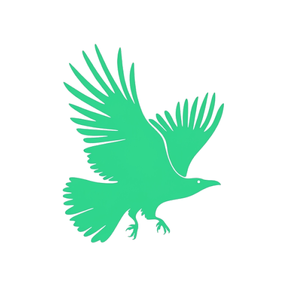
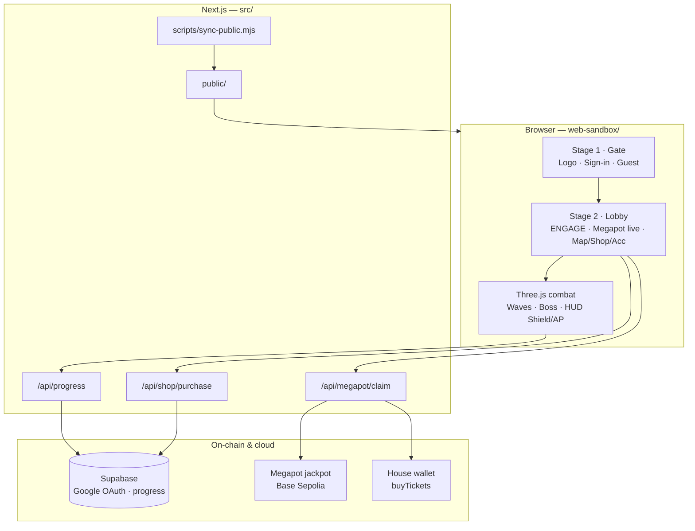
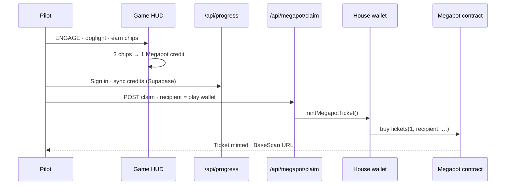
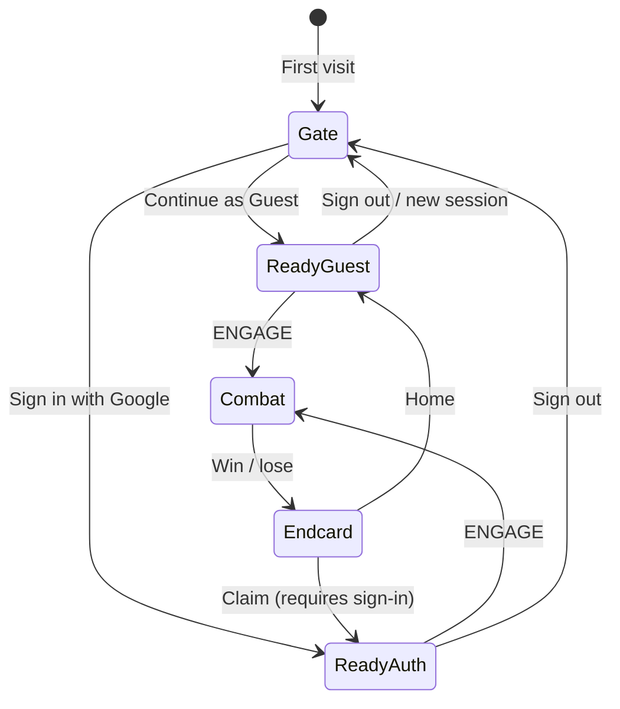

<p align="center">
  
</p>

<h1 align="center">VEIL WAR</h1>

<p align="center">
  <strong>WWII aerial combat × Megapot on Base Sepolia</strong><br />
  <a href="https://veil.sithunyein.com/">veil.sithunyein.com</a> · Megapot Prize Track · Summer Game Jam 2026
</p>

<p align="center">
  
  
  
  
</p>

---

Fly a **3D WWII dogfight** in the browser. Earn **Megapot credits** from combat, sync with Google, then **claim real Megapot tickets on-chain** — house wallet calls `buyTickets` on Base Sepolia.

---

## Judge path (60 seconds)

| Step | Action |
|------|--------|
| 1 | Open **[veil.sithunyein.com](https://veil.sithunyein.com/)** |
| 2 | **Continue as Guest** or **Sign in with Google** |
| 3 | Tap **<< ENGAGE >>** — WASD fly · SPACE fire · destroy scouts |
| 4 | Earn **Base Chips** → **Megapot credits** on mission end |
| 5 | **Sign in** → **CLAIM MEGAPOT TICKET** → open **BaseScan** link |

---

## Architecture



### Megapot core loop



### Lobby flow (two stages)



---

## Project structure

```
veil-war/
├── web-sandbox/              # ★ Source of truth — live game (Three.js SPA)
│   ├── index.html            # Combat loop, HUD, lobby, theaters, SFX
│   ├── js/play-auth.js       # Google OAuth, guest wallet, Megapot claim client
│   └── assets/
│       ├── veil-war-bird-logo.png
│       ├── inco-logo.png · megapot-logo.png
│       └── sfx/              # Engine, guns, explosion, endcard flyby
│
├── src/                      # Next.js API + deploy wrapper
│   ├── app/
│   │   ├── page.tsx          # Redirect → /index.html
│   │   └── api/
│   │       ├── megapot/claim/  # GET pool · POST mint ticket
│   │       ├── progress/       # Cloud save · Google profile
│   │       └── shop/purchase/  # Base Sepolia ETH unlock verify
│   └── lib/
│       ├── megapot/            # viem client · buyTickets · pool read
│       └── shop/catalog.ts     # Armory + theater SKUs
│
├── scripts/
│   └── sync-public.mjs         # web-sandbox → public/ (every build)
│
├── supabase/                   # SQL schema · RLS policies
├── contracts/                  # Solidity (Megapot reward controller, mocks)
├── Assets/                     # Unity fog-duel prototype (legacy / research)
├── .github/workflows/deploy.yml  # web-sandbox → gh-pages mirror
├── vercel.json                 # Production deploy config
├── PHASE12_SETUP.md            # Env vars · Supabase · house wallet
└── PLAN.md                     # Product scope notes
```

> **Judges:** evaluate the **web sandbox** at `veil.sithunyein.com`. Unity under `Assets/` is a separate research prototype.

---

## How to run locally

### Prerequisites

- Node.js 20+
- npm
- (Optional) MetaMask on **Base Sepolia** for shop ETH unlocks
- (Optional) Supabase project + funded house wallet for live claims

### Quick start

```bash
git clone https://github.com/thesithunyein/veil-war.git
cd veil-war
npm install
npm run dev
```

Open **http://localhost:3000** — `npm run dev` syncs `web-sandbox/` → `public/` then starts Next.js.

### Production build

```bash
npm run build
npm start
```

### Environment variables

Copy `.env.example` → `.env.local`. Full setup: **`PHASE12_SETUP.md`**.

| Variable | Purpose |
|----------|---------|
| `HOUSE_PRIVATE_KEY` | Signs Megapot `buyTickets` (needs Sepolia ETH + USDC) |
| `NEXT_PUBLIC_SUPABASE_URL` | Google OAuth + progress |
| `NEXT_PUBLIC_SUPABASE_ANON_KEY` | Client auth |
| `SUPABASE_SERVICE_ROLE_KEY` | Server-side progress upsert |
| `NEXT_PUBLIC_BASE_SEPOLIA_RPC` | Optional RPC override |

**House wallet:** `0xa399Ad139F2393bdFc88CfdafDfd3d5dEDA004D5`  
**Megapot jackpot (Sepolia):** `0x465dA3c859f193A3807386387bEE941B2A4c3279`  
**USDC (Sepolia):** `0x036CbD53842c5426634e7929541eC2318f3dCF7e`

---

## How to deploy

| Target | Trigger | URL |
|--------|---------|-----|
| **Vercel** | Push `master` | [veil.sithunyein.com](https://veil.sithunyein.com/) |
| **GitHub Pages** | `.github/workflows/deploy.yml` | [thesithunyein.github.io/veil-war](https://thesithunyein.github.io/veil-war/) |

```bash
git push origin master          # Vercel auto-build (sync-public + next build)
# gh-pages workflow copies web-sandbox/ to site root
```

---

## Live features

- **Two-stage lobby** — clean gate (logo + sign-in / guest) → full lobby (ENGAGE + icons + Megapot live)
- **Guest instant play** — no OAuth to fly; credits local until sign-in
- **Shield / AP HUD** — integrity bar, heat management, radar
- **Megapot live strip** — drawing #, pool USDC, countdown, global tickets, your odds
- **Daily bonus** — first mission of the day +1 Base Chip
- **Theaters** — Arctic, Pacific, Jungle, Mountains, Village, City
- **Combat XP shop** + optional MetaMask ETH unlocks on Base Sepolia
- **On-chain claim** — endcard → `buyTickets` → BaseScan proof · retry on failure

---

## Megapot integration summary

| Requirement | Implementation |
|-------------|----------------|
| Earn tickets through gameplay | Kills → chips → credits → claim mints 1 ticket |
| Functional Megapot on Base | `buyTickets` via house wallet on Sepolia |
| Core loop, not link-out | Credits earned in-mission; claim on endcard |
| Working public prototype | [veil.sithunyein.com](https://veil.sithunyein.com/) |
| Public repo | This repository |

---

## Unity client (legacy)

`Assets/` contains a **5×5 fog-of-war duel** Unity prototype (Inco FoW research). It is **not** the Megapot jam submission surface. Use the web sandbox for judging.

---

## Links

- **Live game:** https://veil.sithunyein.com/
- **GitHub Pages mirror:** https://thesithunyein.github.io/veil-war/
- **Summer Game Jam:** https://www.inco.org/blog/summer-game-jam-resources-and-what-to-build
- **Megapot docs:** https://docs.megapot.io/

---

<p align="center">
  
  <br />
  <sub>VEIL WAR · Shield integrity · Megapot tickets · Base Sepolia</sub>
</p>
